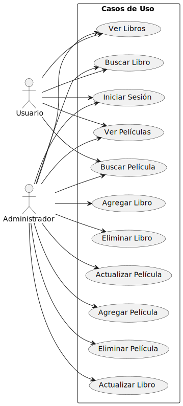

# Documentacion-proyecto-distribuidos
## Descripción General:

Movies and Books Collector es una aplicación desarrollada en tecnología .NET Framework que proporciona a los usuarios una plataforma interactiva para explorar y gestionar información sobre películas y libros a modo de catálogo. La aplicación sigue los principios de arquitectura SOA (Service-Oriented Architecture), permitiendo una comunicación eficiente entre los diferentes servicios. La elaboración del proyecto ha sido dividida en un proyecto back (que maneja la conexión con la base de datos del servidor, elaborada en MongoDB) y otro front que actúa como cliente. Cabe mencionar que se pueden encontrar dentro del proyecto códigos como FavouriteMovie, esta es una funcionalidad que no llegó a terminar de ser implementada, pues requería conocimientos de mongoDB para relacionar colecciones de los cuales carecemos, pero dejamos el código que usamos cuando tratamos de implementarlo.

## Funcionalidades Principales:

### Inicio de Sesión:

Los usuarios pueden iniciar sesión en la aplicación para acceder a funciones personalizadas y gestionar sus preferencias.

### Exploración de Contenido:
Los usuarios pueden elegir entre explorar información sobre películas o libros.

### Operaciones de Películas:

#### Usuarios Normales:
Mostrar lista de películas.
Buscar películas por título.

#### Usuarios Administradores (además de las funciones de usuarios normales):
Añadir nuevas películas.
Actualizar información de películas existentes.
Eliminar películas de la base de datos.

### Operaciones de Libros:

#### Usuarios Normales:
Mostrar lista de libros.
Buscar libros por título.

#### Usuarios Administradores (además de las funciones de usuarios normales):
Añadir nuevos libros.
Actualizar información de libros existentes.
Eliminar libros de la base de datos.

## Arquitectura del Proyecto:

La aplicación sigue una arquitectura basada en servicios, utilizando tecnologías REST para la comunicación entre el cliente y el servidor. La programación asíncrona se emplea para mejorar la eficiencia en la gestión de recursos compartidos, como la base de datos.

## Requisitos y Tecnologías:

Tecnología: .NET Framework
Interfaz de Usuario: Desarrollada con una tecnología compatible con .NET Framework.
Comunicación: Arquitectura SOA mediante servicios REST.
Programación Asíncrona: Se implementa en ciertas partes de la aplicación para mejorar la eficiencia.

## Instrucciones para la implementación:

Crear una base de datos en MongoDB llamada MovieCollector, y dentro de ella añadir las colecciones que han sido exportadas y guardadas en la carpeta "Base de datos" de este repo. 
Correr la base de datos de MongoDB en el puerto 27017 (el puerto por defecto de MongoDB), de no poder hacerse en este, se debe actualizar el archivo MongoConnection del back al puerto adecuado en la línea: "_client = new MongoClient("mongodb://localhost:27017");".
Consumir por el cliente en la dirección https://localhost:44366/...".

## Instrucciones para el uso de la aplicación:

De cara al uso de la aplicación cabe mencionar en primer lugar que si se quiere acceder a la misma y tener todas las funcionalidades se debe acceder con el usuario Admin y la contraseña administrador. Si se quiere entrar como usuario se puede usar cualquier otro de los usuarios de la base con rol User, como por ejemplo: usuario: juanjo, contraseña: juanjo1.

Diagrama de clases del Back

 

Diagrama de clases del Front

 

Diagrama de casos de uso

